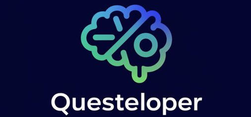
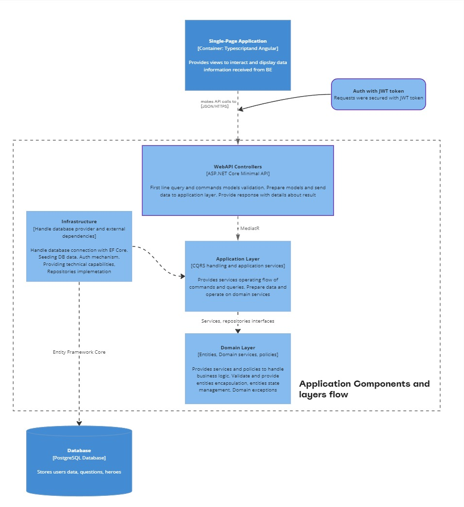
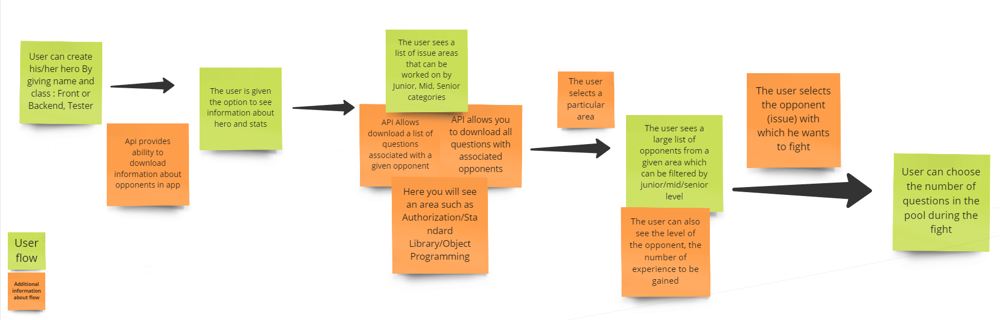
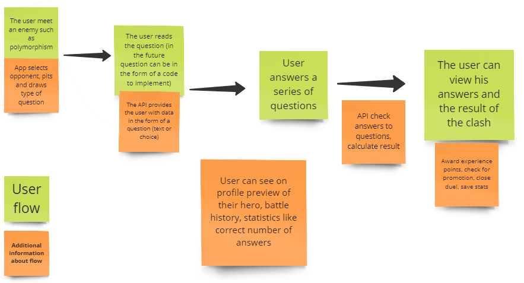

# Questeloper

Welcome to Questeloper Web Application repository, I'm glad you visited. This repository was created as part of the **100 commits** initiative, if you want to see the projects of others, see link - https://100commitow.pl/repozytoria

<p align="center">
  <a >
    
  </a>
</p>

# About project

Questeloper is an application that aims to facilitate the preparation for an interview (mainly technical) for IT professionals. As a user, you will be faced with questions that will involve defeating a virtual opponent which will be specific programming and technical areas. Authorization, architecture, data structures are the opponents you will have to face. Create your own hero, gain experience and acquire new skills to help you overcome challenges. In the first release of the application, you will have the opportunity: 
- Create an account and a hero from a given frontend/backend/tester class
- Preview of the categories, areas, and opponents you will fight
-  Fight your opponent by answering his questions a given area (in the form of questions and answers from technical talks)
	 > **Note:** For example, we choose the area of object-oriented programming where we hit the opponent "Inheritance" (Sick!). We enter a virtual clash with him where to defeat him we have to answer his set of questions in this topic 
- Gain experience for overcoming a challenge, advance a character, check combat stats
- Compare yourself with other users at a similar level, or check the global ranking

# 100 commits - Delivery plan 
Below you can see the planned scope of delivery of parts of the application and the assumptions to be realized within ~ 3 months of work
> **Note** Depending on time, possible contributors and progress, the scope may expand or change a little bit. 

**First month delivery - backend part**
The first stage involves the delivery of the server part of the application
- Basic structure of the project on the backend side
- Providing communication with the database
- Provide communication with the API and perform basic operations on resources
- Enable account creation and user authentication in the application 
- Depending on the remaining time - refactoring, unit and integration tests

**Second month delivery - frontend part**
The second stage involves providing the client part of the application
- Create basic views and application components on the client side of the API
- Develop a system for logging, storing and managing authorization tokens
- Connecting communication with the server
- Hadle reqeuests and responses to server and enabling client-side operations
- Time dependent - Refinement of views, architecture review, refactoring
> **Note** Probably the most challenging part due to low experience inTypeScript and Angular

**Third month delivery - technical details and buffer**
The third stage in the first instance assumes a time buffer for the delivery of requirements before the official end of the initiative. If the core business assumptions can be delivered on time, the remaining time will be used for technical details and implementation of additional technologies:
- Containerization of applications using docker
- Advanced application log management with Elasticsearch and kibana deployment
- Trying and learning how to deploy an application to a cloud system
- Preparing a plan and learning how to implement CI/CD (Github Actions)

# Technology stack

**Backend side**
- C# and .NET 8
- Clean Architecture
- Entity Framework Core with PostgreSQL database
- CQRS with MediatR
- FluentValidation
- Minimal API
- Serilog
- XUnit, NSubstitute, Shouldly, TestContainers
- Swagger for API documentation

**Frontend side**
- TypeScript
- HTML and CSS
- Angular 17
- NodeJS

**Others**
- Docker

# Application Overview
Below are some screenshots of basic architecture information and separate notes on data settings and user operations in the application. This will help you look and imagine how the application is supposed to work in its basic version
A basic overview of the architecture and data flow of the application::

<p align="center">
  <a >
    
  </a>
</p>

Overview of the user flow in the application from the stage of creating the hero to the moement of the clash with the enemy:

<p align="center">
  <a >
    
  </a>
</p>

Here is a brief overview of the user flow in the application from the opponent's meeting stage to the clash summary

<p align="center">
  <a >
    
  </a>
</p>

> **Note** At this stage, the above information is intended to help you look at the main concept of the application. As the application develops and new additions are made, the section will be supplemented with additional information and screenshots showing the appearance of the UI

# Build and run project
Information about the build and launch project will be provided soon when the basic structure and components of the application are ready for basic operation

# Information for contributors
There is a possibility for you to contribute and become a part of this project. First, please take a look at the list of issues to find something that you can work on. If there are no issues that match your skillset, please feel free to contact me via email or on my Discord profile (see contact section). I will review your request and try to find something for you to work on based on our current workload.

> **Note** Feel free to submit any suggestions or proposals by creating an issue on GitHub.

**Branch strategy**
For managing branches I choose GitHub Flow to simplify developement workflow.

> **Note** On this project core branch is 'main'. If you start working on some issue please use these templates for branch names: <br> **feature/this-is-example-feature** or **defect/this-is-example-defect**

<p align="center">
  <a >
    
  </a>
</p>

**Quick start**
If you're new, I have prepared a quick start guide for you:

1. Clone repository via SSH
```sh
git clone git@github.com:MarcinKanarDev/Questeloper.git
```
or via HTTPS
```sh
git clone https://github.com/MarcinKanarDev/Questeloper.git
```
2. Create properly branch

```sh
git checkout -b feature/this-is-example-feature
```
3. Write your code and create a commits

```sh
git commit -am "Example commit"
```
4. Push your branch to repository

```sh
git push origin feature/this-is-example-feature
```
5. Create a pull request on GitHub

# Contact
Email: marcinkanardev@gmail.com
Discord Username: abachaczi